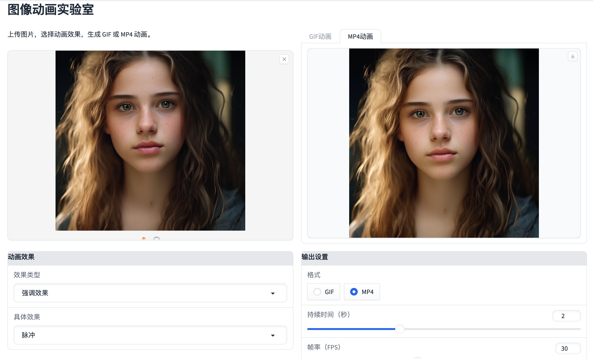

# 图像动画实验室 (Image Animation Lab)

<p align="center">
  
</p>

一个简单易用的Web应用，可以为您的图片添加各种有趣的动画效果，并导出为 GIF 或 MP4 格式。

## 效果演示

| 效果1 | 效果2 |
| :---: | :---: |
| <video src="https://github.com/user-attachments/assets/3f180f9f-0e98-405b-ae88-c774f9ace0e0" width="300"> | <video src="https://github.com/user-attachments/assets/b5df0a53-b36e-4370-ba83-e02d5a1f4e37" width="300"> |

| 效果3 | 效果4 |
| :---: | :---: |
| <video src="https://github.com/user-attachments/assets/f1f54479-7dd4-4818-960a-83bfbd16e1cc" width="300"> | <video src="https://github.com/user-attachments/assets/9f9d4adc-72a8-48ad-b3a1-6a4b5b75d245" width="300"> |

## 功能特性

- **多种动画效果**:
  - **入场**: 淡入, 滑入, 放大出现等。
  - **消失**: 淡出, 滑出, 缩小消失等。
  - **强调**: 脉冲, 摇晃, 旋转, 惊喜, 闪烁, 摆动等。
- **自定义输出**:
  - 支持 GIF 和 MP4 两种格式。
  - 可自由调整动画的持续时间和帧率。


## 运行

执行以下命令启动应用：

```bash
python app.py
```

然后，在浏览器中打开提供的本地 URL (例如 `http://127.0.0.1:7860`) 即可开始使用。

## 项目结构

```
.
├── animations/         # 存放所有动画效果的模块
├── examples/           # 存放示例图片
├── outputs/            # 存放生成的动画文件
├── app.py              # 主应用文件
└── README.md           # 项目说明
```
